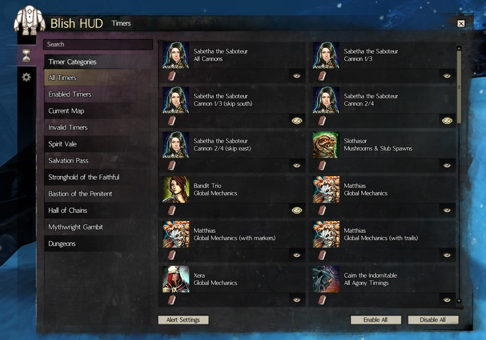

# Timers

A notification plugin built with the [BlishHud](https://blishhud.com/) framework for Guild Wars 2.

Our goal is to help you complete hardcore content with confidence.
___

# What it does

Loads customized timer files which you can enable/disable individually.
For premade timer files click [here](https://github.com/QuitarHero/Hero-Timers/releases/tag/v1.0.0) (developed by QuitarHero)

Receive alerts for all important boss mechanics.\

Show Location Based Markers anywhere on the map\

Displays direction routes to tell you where you need to go. 
You can combine different elements to get the best results!

Easily customizable. Notifications are resizable and can be moved to anywhere on the screen.

___
# Installation
1. Download the latest version of [BlishHud](https://blishhud.com/) and run it.
2. Download the latest release of [Timers](https://github.com/Dev-Zhao/Timers_BlishHUD/releases)
3. Add the `Timers.bhm` file you have downloaded to `Documents\Guild Wars 2\addons\blishhud\modules`
4. Create your own or download [existing timer files](https://github.com/QuitarHero/Hero-Timers/releases/tag/v1.0.0) and place them in `Documents\Guild Wars 2\addons\blishhud\timers`

___
# Have Questions or Issues?

Please visit our [discord community](https://discord.com/invite/FYKN3qh) for help and support!

